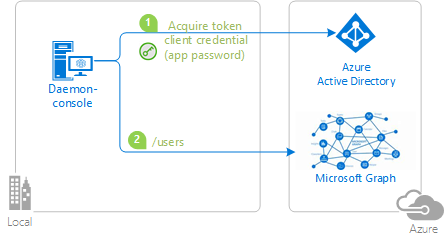
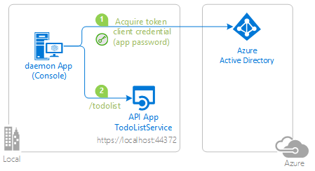

# A .NET Core daemon console application using Azure AD V2

[](https://identitydivision.visualstudio.com/IDDP/_build/latest?definitionId=695)

## About this sample

### Scenario

You have a daemon application and you want it to consume Microsoft Graph or your own Web Api using **Microsoft Identity Platform** to acquire tokens.

### Structure of the repository

This repository contains a progressive tutorial made of two parts:

Sub folder                    | Description
----------------------------- | -----------
[1-Call-Graph](https://aka.ms/msidentity-aspnetcore-webapi) | This sample application shows how to use the Microsoft identity platform endpoint to access the data of Microsoft business customers in a long-running, non-interactive process. It uses the OAuth 2 client credentials grant to acquire an access token, which can be used to call the Microsoft Graph and access organizational data </p> 
[2-Call-OwnApi](https://aka.ms/msidentity-aspnetcore-webapi-calls-msgraph)  | This sample application shows how to use the Microsoft identity platform to access the data from a protected Web API, in a non-interactive process. It uses the OAuth 2 client credentials grant to acquire an access token, which is then used to call the Web API. Additionally, it lays down all the steps developers need to take to secure their Web APIs with the Microsoft identity platform. </p>  

## How to run this sample

To run this sample, you'll need:

- [Visual Studio 2017](https://aka.ms/vsdownload) or just the [.NET Core SDK](https://www.microsoft.com/net/learn/get-started)
- An Internet connection
- A Windows machine (necessary if you want to run the app on Windows)
- An OS X machine (necessary if you want to run the app on Mac)
- A Linux machine (necessary if you want to run the app on Linux)
- An Azure Active Directory (Azure AD) tenant. For more information on how to get an Azure AD tenant, see [How to get an Azure AD tenant](https://azure.microsoft.com/en-us/documentation/articles/active-directory-howto-tenant/)
- A user account in your Azure AD tenant. This sample will not work with a Microsoft account (formerly Windows Live account). Therefore, if you signed in to the [Azure portal](https://portal.azure.com) with a Microsoft account and have never created a user account in your directory before, you need to do that now.

### Step 1:  Clone or download this repository

From your shell or command line:

```Shell
git clone https://github.com/Azure-Samples/active-directory-dotnetcore-daemon-v2.git
```

or download and exact the repository .zip file.

> Given that the name of the sample is pretty long, and so are the name of the referenced NuGet packages, you might want to clone it in a folder close to the root of your hard drive, to avoid file size limitations on Windows.

## Community Help and Support

Use [Stack Overflow](http://stackoverflow.com/questions/tagged/msal) to get support from the community.
Ask your questions on Stack Overflow first and browse existing issues to see if someone has asked your question before.
Make sure that your questions or comments are tagged with [`msal` `dotnet`].

If you find a bug in the sample, please raise the issue on [GitHub Issues](../../issues).

If you find a bug in msal.Net, please raise the issue on [MSAL.NET GitHub Issues](https://github.com/AzureAD/microsoft-authentication-library-for-dotnet/issues).

To provide a recommendation, visit the following [User Voice page](https://feedback.azure.com/forums/169401-azure-active-directory).

## Contributing

If you'd like to contribute to this sample, see [CONTRIBUTING.MD](/CONTRIBUTING.md).

This project has adopted the [Microsoft Open Source Code of Conduct](https://opensource.microsoft.com/codeofconduct/). For more information, see the [Code of Conduct FAQ](https://opensource.microsoft.com/codeofconduct/faq/) or contact [opencode@microsoft.com](mailto:opencode@microsoft.com) with any additional questions or comments.

## More information

For more information, see MSAL.NET's conceptual documentation:

- [Quickstart: Register an application with the Microsoft identity platform](https://docs.microsoft.com/azure/active-directory/develop/quickstart-register-app)
- [Quickstart: Configure a client application to access web APIs](https://docs.microsoft.com/azure/active-directory/develop/quickstart-configure-app-access-web-apis)
- [Acquiring a token for an application with client credential flows](https://aka.ms/msal-net-client-credentials)

For more information about the underlying protocol:

- [Microsoft identity platform and the OAuth 2.0 client credentials flow](https://docs.microsoft.com/en-us/azure/active-directory/develop/v2-oauth2-client-creds-grant-flow)

For a more complex multi-tenant Web app daemon application, see [active-directory-dotnet-daemon-v2](https://github.com/Azure-Samples/active-directory-dotnet-daemon-v2)
